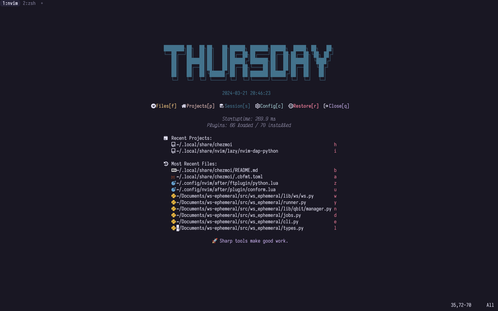

<div align="center">
  
</div>

Collection of personal dotfile, managed via chezmoi.



## Installation

### Linux Setup

Below code will install chezmoi in local bin directory and start
applying the existing setup.

```bash
export BINDIR="$HOME/.local/bin"
export PATH="$HOME/.local/bin:$PATH"
sh -c "$(curl -fsLS chezmoi.io/get)" -- init dhruvinsh --apply --exclude externals
chezmoi apply
```

### Windows Setup

Below code will install chezmoi and start applying config changes for the
windows system.
**NOTE: This installation expect manual installation of Powershell 7 (pwsh)**

```powershell
Set-ExecutionPolicy RemoteSigned -Scope CurrentUser
irm get.scoop.sh | iex

scoop install chezmoi
chezmoi init dhruvinsh --apply --exclude externals
chezmoi apply
```

### Mac Setup

All the installation on mac managed by brew.

```bash
/bin/bash -c "$(curl -fsSL https://raw.githubusercontent.com/Homebrew/install/HEAD/install.sh)"
eval "$(/opt/homebrew/bin/brew shellenv)"

brew install chezmoi
chezmoi init dhruvinsh --apply --exclude externals
chezmoi apply
```

### Arch Installation

See these file, [Installation](Installation.md)

## Credits

- Thanks [Tom Payne](https://github.com/twpayne) for awesome tool: [chezmoi](https://github.com/twpayne/chezmoi)
- Arch Linux installation guide: [Arch Wiki](https://wiki.archlinux.org/title/Installation_guide)
- Wallpapers credits: [VictorTennekes](https://www.reddit.com/user/VictorTennekes/)
  All the wallpaper can be found [HERE](home/private_dot_wallpaper/)
